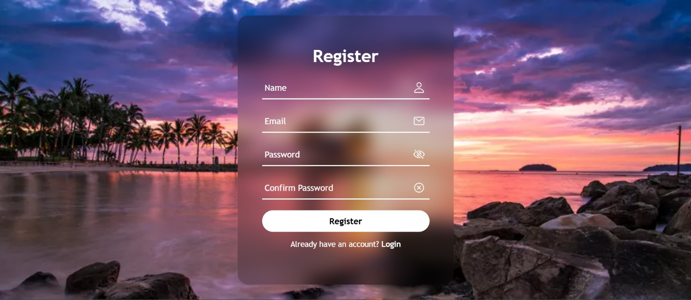
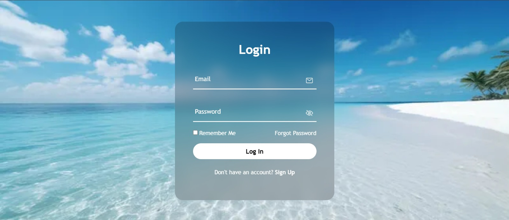
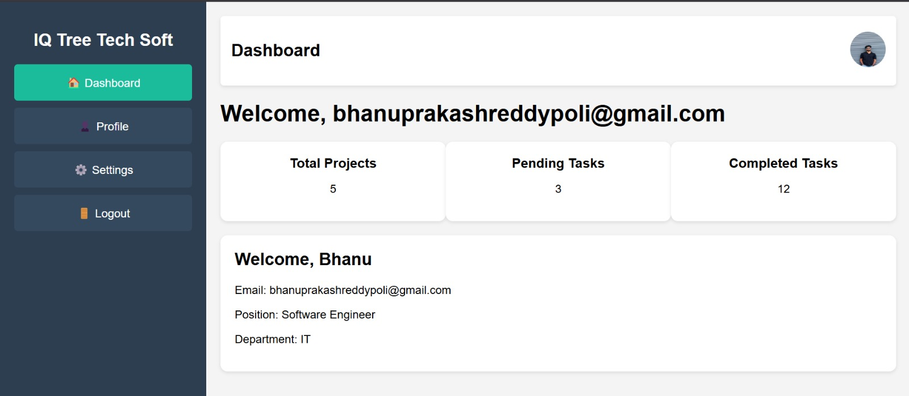

# 🛡️ Mini Fullstack Authentication App

This is a simple fullstack authentication application built using **Spring Boot (Java)** for the backend and **HTML, CSS, and JavaScript** for the frontend. 

The project is structured and run as a single unit inside **Spring Tool Suite (STS)**. All frontend files are served from the `static` folder of the Spring Boot application.

## 📷 Screenshots

### 📝 Registration Page


### 🔐 Login Page


### 📊 Employee Dashboard



## 🚀 Features

- 📝 **User Registration**  
  - Register with email and password  
  - Prevent duplicate registrations using the same email  
  - Basic form validation (email format, password strength)  
  - Passwords are encrypted before storing in the local database

- 🔐 **User Login**  
  - Login with email and password  
  - Validates credentials against stored user data  
  - Redirects to a protected employee dashboard on successful login  
  - Session-based login with logout functionality

- 🧠 **Technologies Used**  
  - **Backend**: Java, Spring Boot  
  - **Frontend**: HTML, CSS, JavaScript  
  - **Database**: Local database (e.g., MySQL or PostgreSQL )

----------------------------------------------------------------------------------------------------------------------------------------------------------

## 🛠️ Getting Started

### Prerequisites

- Java 17+ (or compatible version)
- Spring Tool Suite (STS) or IntelliJ / Eclipse
- Maven
- Local DB setup (e.g., MySQL, PostgreSQL)

### Running the Application

1. Clone the repository
   ```bash
   git clone https://github.com/your-username/your-repo-name.git
###  📁 Project Structure
1.  src/main/java - #Java source code(Controllers, services, models)
2.  src/main/resources/static -#Front end files (HTML, CSS, JS)
3.  src/main/resources/application.properties


--------------------------------------------------------------------------------------------------------------------------------------------------------------

### 📌 Future Enhancements

🔄 Fully functional dashboard with employee features

🛡️ Role-based access control (Admin/User)

📧 Email verification or OTP-based login

📊 User activity tracking and analytics

🧪 Unit and integration testing

### 🙌 **Acknowledgements**
This project was developed as a personal mini-project to showcase fullstack development skills using Java and web technologies.
